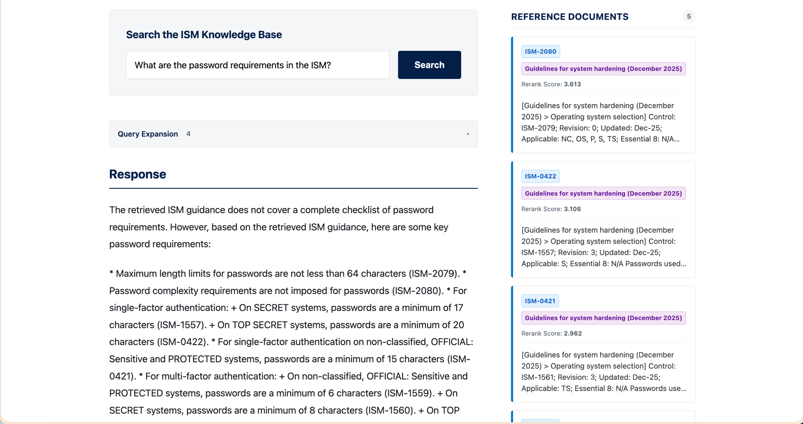
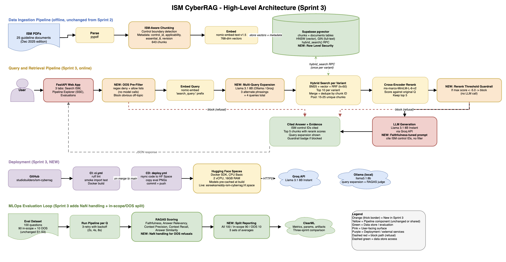

# ISM CyberRAG

**Ask the Australian Information Security Manual a question in plain English. Get a cited answer back, or a refusal if the question is out of scope.**

Live app: https://esreekarreddy-ism-cyberrag.hf.space
Code: https://github.com/studiobuilders/ism-cyberrag
License: MIT



## What it does

ISM CyberRAG is a Retrieval-Augmented Generation system over the Australian Information Security Manual (ISM). You type a question in natural language. The system retrieves the most relevant ISM controls, generates an answer grounded in those controls, and surfaces the control IDs it relied on so you can verify the answer against the source.

If your question is not in the ISM (a weather query, a coding task, anything off-topic), the system refuses instead of inventing an answer. Refusal is a feature, not a bug.

## Why it exists

The ISM is the Australian Government's cyber security control catalogue. The local project corpus is the December 2025 ISM release: 25 guideline PDFs with 1,073 unique control IDs extracted from the source files. People who use it (IRAP assessors, CISOs, internal security teams, IT staff working under the manual) almost always want one specific control, not the whole document. Reading the ISM cover-to-cover to find that one control is slow.

A naive RAG pipeline over the ISM has two specific failure modes that make it unsafe for compliance work:

1. It hallucinates control IDs that look real but are not in the document. A confident "ISM-1234" that turns out to be a different control.
2. It blends advice from unrelated controls into one answer, which is dangerous when an assessor or auditor is relying on the response.

ISM CyberRAG is built to stop both failure modes. Every claim in an answer cites a control ID that is actually present in the retrieved context, and a two-stage guardrail refuses anything outside the ISM corpus before the language model is ever called.

## Who it's for

- **IRAP assessors** running through the manual against a client system
- **CISOs and infosec teams** needing a quick, cited answer to a control question
- **IT staff and developers** who are not security specialists but have to comply with the ISM
- **Researchers and students** studying RAG systems on a real-world, structured corpus

## How it works



The system has four pipelines.

**Ingest.** 25 ISM PDFs (files 01 to 25, excluding consolidated file 00 to avoid duplicated content) are parsed with `pypdf`. An ISM-aware chunker splits on control boundaries (`Control: ISM-XXXX` markers), attaches metadata (control ID, applicability, Essential Eight level, revision), and produces 643 chunks. Each chunk is embedded with `nomic-embed-text-v1.5` (768 dimensions) and written to Supabase Postgres, which provides `pgvector` for vector search and a GIN index on the full-text column for BM25.

**Retrieve and generate.** When a user asks a question:
1. A regex pre-filter checks against an allow list of 86 ISM and security terms plus a deny list of obvious off-topic patterns. Off-topic questions short-circuit here.
2. Llama 3.1 generates three paraphrases of the question.
3. All four queries (original plus three variants) run hybrid search against Supabase in parallel. Hybrid search combines BM25 keyword matching with vector similarity, merged using Reciprocal Rank Fusion (k = 50).
4. Results are deduplicated by chunk ID and reranked by a cross-encoder (`ms-marco-MiniLM-L-6-v2`) against the original question (not the paraphrases) so relevance stays anchored.
5. If the top rerank score falls below -5.0, the second-stage guardrail refuses. Otherwise, the top 5 chunks go to Llama 3.1 8B (via Groq) with a system prompt that requires every claim to cite a control ID present in the retrieved context.

**Deploy.** GitHub Actions runs lint, smoke test and Docker build on every push. On merge to main, the codebase is rsynced to a Hugging Face Space, which rebuilds the container automatically.

**Evaluate.** A hand-written set of 100 questions (Easy 30, Medium 30, Hard 20, Very Hard 10, Out-of-Scope 10) is scored with RAGAS on five metrics: faithfulness, answer relevancy, context precision, context recall, answer similarity. Every run is logged to ClearML with the full config snapshot and per-question CSV.

## Try it

The live app at https://esreekarreddy-ism-cyberrag.hf.space has three tabs.

- **Search ISM.** Ask a question, see a cited answer and the source chips with rerank scores.
- **Pipeline Explorer.** Same question, but streams the seven pipeline stages over Server-Sent Events so you can see what each step did.
- **Evaluations.** RAGAS metrics across all three sprints, plus the chart grid from each evaluation run.

Example queries that exercise different paths:

| Query | Path it triggers |
|-------|------------------|
| `What does ISM-1997 require?` | In-scope, single-control lookup |
| `How should we encrypt data at rest on government laptops?` | Multi-query expansion (no exact ISM phrasing) |
| `What are the password requirements in the ISM?` | Multi-query plus multi-control synthesis |
| `What is the weather in Sydney today?` | Out-of-scope, Stage 1 guardrail refuses |
| `Write me a bash backup script.` | Out-of-scope, Stage 1 guardrail refuses |

Cold starts on the free Hugging Face Spaces tier are 30 to 60 seconds while the container wakes up.

## Results

Same LLM, same embedder, same evaluation set across all three sprints, so the numbers compare cleanly.

| Metric | Sprint 1 | Sprint 2 | Sprint 3 | Sprint 3 target | Met |
|--------|----------|----------|----------|-----------------|-----|
| Faithfulness | 0.6834 | 0.7341 | 0.8351 | > 0.78 | Yes |
| Answer Relevancy | 0.7216 | 0.7678 | 0.9078 | > 0.82 | Yes |
| Context Precision | 0.7885 | 0.8598 | 0.8590 | > 0.85 | Yes |
| Context Recall | 0.8224 | 0.8659 | 0.9249 | > 0.91 | Yes |
| Answer Similarity | N/A | 0.9057 | 0.9179 | > 0.93 | No (-0.012) |

Four of five Sprint 3 targets were met. Answer similarity missed by 0.012, so the target remains an honest documented miss. All chart outputs are in `evaluations/sprint-3/`.

## Quick start

### Prerequisites

- Python 3.11
- A Supabase project with `pgvector` enabled
- A Groq API key (free tier is enough for development)
- Optionally, Ollama running locally if you want to use a local Llama for query expansion and evaluation

### Install

```bash
git clone https://github.com/studiobuilders/ism-cyberrag.git
cd ism-cyberrag
python -m venv .venv
source .venv/bin/activate
pip install -r requirements.txt
```

### Configure

```bash
cp .env.example .env
# Open .env and fill in your keys
```

Required:

| Variable | Where to get it |
|----------|-----------------|
| `SUPABASE_URL` | Supabase project settings, API |
| `SUPABASE_PUBLISHABLE_KEY` | Supabase project settings, API (anon key) |
| `GROQ_API_KEY` | https://console.groq.com/keys |

Enable Row Level Security on the `documents` and `chunks` tables using `database/sprint3_rls.sql`, which creates `SELECT` RLS policies for `anon` and `authenticated` and does not create write policies for those roles.

Optional, but recommended:

| Variable | Default | Purpose |
|----------|---------|---------|
| `EVAL_LLM_PROVIDER` / `EVAL_LLM_MODEL` | `ollama` / `llama3.1:8b` | Local LLM for RAGAS evaluation (avoids API rate limits) |
| `QUERY_EXPANSION_PROVIDER` / `QUERY_EXPANSION_MODEL` | `ollama` / `llama3.1:8b` | Local LLM for multi-query expansion in development |
| `MULTI_QUERY_COUNT` | `3` | Number of alternate phrasings per question |
| `OOS_RERANK_THRESHOLD` | `-5.0` | Stage 2 guardrail cutoff |
| `WEB_CACHE_ENABLED` | `true` | In-process cache for the web demo |
| `CLEARML_API_*` | (from ClearML) | Experiment tracking |

The full list is in `.env.example`.

### Run

```bash
uvicorn app.main:app --reload
```

Open http://localhost:8000.

### Re-run the evaluation

Open `notebooks/sprint3_development.ipynb` in Jupyter or Colab. The notebook ingests the PDFs (if needed), runs the full retrieve-and-generate pipeline against the 100-question dataset, computes RAGAS scores, writes per-question CSVs, generates chart PNGs into `evaluations/sprint-3/`, and logs everything to ClearML.

## Tech stack

| Component | Tool |
|-----------|------|
| PDF parsing | `pypdf` |
| Chunking | ISM-aware (control boundary detection) |
| Embeddings | `nomic-ai/nomic-embed-text-v1.5` (768-dim) |
| Vector database | Supabase Postgres with `pgvector` (HNSW + GIN) |
| Retrieval | Hybrid BM25 + vector with Reciprocal Rank Fusion |
| Reranking | `cross-encoder/ms-marco-MiniLM-L-6-v2` |
| Query expansion | Multi-query via Llama 3.1 (Ollama or Groq) |
| OOS guardrail | Two-stage: keyword pre-filter + rerank score threshold |
| Generation | Llama 3.1 8B via Groq |
| Web app | FastAPI + Jinja2, Server-Sent Events for the pipeline explorer |
| Evaluation | RAGAS (5 metrics) |
| Experiment tracking | ClearML |
| CI/CD | GitHub Actions |
| Deployment | Hugging Face Spaces (Docker) |

We deliberately did not use LangChain or LlamaIndex. The pipeline is around 1,500 lines of plain Python across `src/`, small enough to read in one sitting and easier to debug than tracking down framework behaviour.

## Project structure

```
ism-cyberrag/
├── app/                          FastAPI web app
│   ├── main.py                   Entry point
│   ├── routes.py                 /chat, /pipeline/stream, web caching
│   ├── static/                   CSS and chart images for the dashboard
│   └── templates/                Jinja2 templates (search, pipeline, evaluations)
├── src/                          Pipeline modules
│   ├── config.py                 Environment-driven settings
│   ├── parse_pdf.py              pypdf wrapper
│   ├── chunking.py               ISM-aware chunker
│   ├── embeddings.py             nomic-embed-text-v1.5 wrapper
│   ├── supabase_utils.py         Supabase client
│   ├── retrieval.py              Hybrid search + multi-query merge
│   ├── reranking.py              Cross-encoder reranker
│   ├── query_expansion.py        Multi-query expansion
│   ├── guardrail.py              Two-stage OOS guardrail
│   ├── llm.py                    Answer generation
│   └── evaluation.py             RAGAS + ClearML
├── data/                         ISM source PDFs (files 01 to 25)
├── database/                     Supabase schema and RLS policies
├── evaluations/                  Eval dataset and per-sprint result CSVs and charts
├── notebooks/                    Sprint 1, 2, 3 development notebooks
├── scripts/                      HPO controller, ingestion scripts
├── docs/                         Sprint pipeline reports, deployment guide
│   └── assets/                   README images (architecture diagram, screenshot)
├── .github/workflows/            ci.yml and deploy.yml
├── Dockerfile                    Production image for HF Spaces
└── requirements.txt
```

## CI/CD

Two workflows in `.github/workflows/`:

**`ci.yml`** runs on every push and pull request. Three parallel jobs:
- `lint`: `ruff check` on `src/` and `app/`
- `smoke-test`: install requirements, set placeholder env vars, import `app.main`
- `docker-build`: build the production image (not pushed)

**`deploy.yml`** runs on merge to main. Clones the Hugging Face Space repository using `HF_TOKEN`, rsyncs the codebase (excluding `data/`, `notebooks/`, `evaluations/`, `docs/`, `scripts/`, `.env`), copies evaluation chart PNGs into `app/static/evaluations/`, then pushes. The Space rebuilds the container automatically.

Required GitHub secrets: `HF_TOKEN`, `HF_SPACE_NAME`. Full setup is documented in `docs/sprint-3/DEPLOYMENT_GUIDE.md`.

## Hyperparameter tuning

All retrieval-side parameters live in `src/config.py` and are documented in `docs/sprint-3/SPRINT3_TECHNIQUES.md`. A ClearML `HyperParameterOptimizer` sweep over `OOS_RERANK_THRESHOLD` in `{-7, -6, -5, -4, -3}` confirmed the calibrated value of -5.0 (the metric is flat across this range, so calibration drives the choice rather than the sweep). Controller and base-task code are in `scripts/hpo_*.py`. Sweep outputs are in `evaluations/sprint-3/hpo/`.

## Known limitations

- **Answer similarity 0.918 vs 0.93 target.** The declared target was missed by 0.012. The likely cause is a style mismatch between the Sprint 3 prompt output and the older reference answers; closing it honestly requires a small reference-answer review or prompt adjustment, not over-fitting during the final sprint.
- **Free-tier hosting.** Hugging Face Spaces CPU Basic (2 vCPU, 16 GB) is enough for a demo. Cold starts are 30 to 60 seconds. Concurrent load will queue.
- **English only.** The embedder and the generator are English models. Multilingual support is a planned extension.
- **Quarterly ISM refresh is manual.** When the ACSC publishes a new ISM, re-ingestion is currently a manual step.
- **RAGAS on refusals.** The library returns NaN or 0.0 on correctly-refused out-of-scope questions for some metrics. We fill those rows to 1.0 only for confirmed OOS refusals, log the count, and preserve the raw RAGAS output in the per-question CSV. See `docs/sprint-3/SPRINT3_TECHNIQUES.md` for the methodology.

## Roadmap

In rough order of impact, the work we would do next is:

1. **Multilingual embeddings and generation** (multilingual-e5 + a multilingual Llama variant), since the audience that most benefits from a plain-language ISM includes non-native English speakers.
2. **Automatic quarterly re-ingestion** so the corpus tracks ACSC releases without manual work.
3. **Close the answer-similarity gap** by rewriting the ground-truth answers to match the Sprint 3 prompt style.
4. **NIST SP 800-53 mapping tab** so compliance teams working across multiple standards can crosswalk.

## Sprint progression

| Sprint | What was added | Headline metric |
|--------|----------------|-----------------|
| Sprint 1 | Baseline RAG: fixed-size chunking (1000 char), vector-only search, Llama 3.1 via Groq, RAGAS on 100 questions | Faithfulness 0.68 |
| Sprint 2 | ISM-aware chunking (643 chunks), hybrid search with RRF, cross-encoder reranking, FastAPI web app | Faithfulness 0.73 |
| Sprint 3 | Multi-query expansion, two-stage OOS guardrail, threshold calibration, Pipeline Explorer, Evaluations dashboard, web caching, CI/CD, Hugging Face Spaces deployment | Faithfulness 0.84 |

## Team

Built as a university capstone project for AI Studio at the University of Technology Sydney, Autumn 2026.

| Member | Student ID |
|--------|-----------|
| Sreekar Reddy Edulapalli | 25617806 |
| Chandan Sreenivasaiah | 25674250 |
| Ruben Easo Thomas | 25598184 |

Roles rotated each sprint (Product Owner, Data Engineer, Data Scientist) so each of us has held all three positions.

## Acknowledgments

- The **Australian Signals Directorate** for publishing the ISM under permissive terms.
- The **UTS AI Studio** teaching team for sprint-by-sprint feedback.
- The open-source maintainers behind `pypdf`, `nomic-ai/nomic-embed-text-v1.5`, `ms-marco-MiniLM-L-6-v2`, RAGAS, ClearML, FastAPI, Supabase, and Groq.

## License

MIT. See [`LICENSE`](LICENSE) for details.
